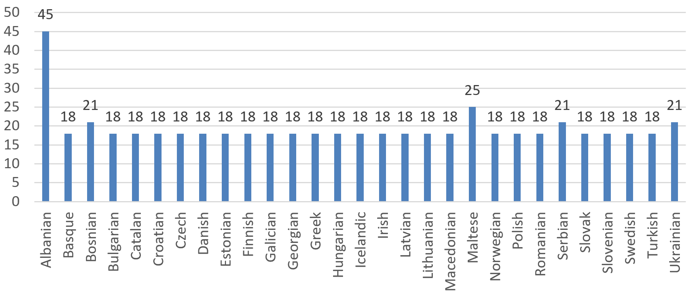

# OpenEuroLLM Non-Web-Data Guide

This guide and repository compiles information and useful scripts about the acquisition of non-web-data for the OpenEuroLLM project.  

The task of gathering linguistic data different from web data content implies several steps such as:

1) Locating permissively licensed data sources (mainly sets of files)
2) Extracting file URLs
3) Downloading the files
4) Uploading the files to a server
5) Downloading the files to a cluster
6) Processing the files to extract text

This guide will be growing as we complete a first cycle through all the steps. 

<h2>1. Locating data sources</h2>

<h3>1.1 Basic information</h3>

We are looking for websites containing sets of files with relevant linguistic data in any format (pdf, docx, txt, mp3, mp4, etc.) with an explicit open license. 

We do not want the text present on the web page itself, like HTML or similar, but downloadable documents whose text is not visible using web browsers. The web content (HTML) is supposed to be already gathered in web datasets.

<h3>1.2 Picking a language</h3>

We will look for sources in particular languages. The languages of interest are defined in the following [file](https://github.com/OpenEuroLLM/training-data-catalogue/blob/main/languages).

Languages with less resources sould be prioritized. A hint for picking your next language could be the following ranking showing the biggest web dataset available for the languages of interest, leaving out English, Italian, French, German, Portuguese and Spanish: 


Please log your team name in the following table once you pick a language and start working with it. These are all the priority languages with information about data availability and the team in charge for a particular cycle: 


|Language|Data availability| Cycle 0 - Completed | Cycle 1 - Ongoing|
|--------|--------------|------------------|------------------|
| Basque (eus_Latn)| very low | ELDA & Prompsit | Prompsit |
| Galician (glg_Latn)| very low | ELDA | Prompsit |
| Georgian (kat_Geor) | very low | ELDA | Prompsit |
| Icelandic (isl_Latn) | very low | ELDA | ELDA |
| Irish (gle_Latn) | very low | ELDA | ELDA |
| Macedonian (mkd_Cyrl) | very low | ELDA | ELDA |
| Maltese (mlt_Latn) | very low | ELDA | |
| Norwegian Nynorsk (nno_Latn) | very low | ELDA | Prompsit |
| Albanian (sqi_Latn als_Latn) | low | ELDA & Prompsit | Prompsit |
| Bosnian (bos_Latn) | low | ELDA | ELDA |
| Catalan (cat_Latn) | low | ELDA | Prompsit |
| Croatian (hrv_Latn) | low | ELDA | ELDA |
| Estonian (est_Latn ekk_Latn)| low | ELDA | |
| Latvian (lav_Latn ltg_Latn lvs_Latn) | low | ELDA | |
| Lithuanian (lit_Latn) | low | ELDA | |
| Serbian (srp_Cyrl spr_Latn) | low | ELDA | |
| Slovenian (slv_Latn) | low | ELDA | |
| Bulgarian (bul_Cyrl) | mid-low | ELDA | |
| Danish (dan_Latn) | mid-low | ELDA | |
| Finnish (fin_Latn) | mid-low | ELDA | |
| Greek (ell_Grek) | mid-low | ELDA | |
| Hungarian (hun_Latn) | mid-low | ELDA | |
| Norwegian Bokmal (nob_Latn) | mid-low | ELDA | |
| Romanian (ron_Latn) | mid-low | ELDA | |
| Slovak (slk_Latn)| mid-low | ELDA | |
| Swedish (swe_Latn) | mid-low | ELDA | |
| Ukrainian (ukr_Cyrl) | mid-low | ELDA | |
| Czech (ces_Latn) | mid | ELDA | |
| Turkish (tur_Latn) | mid| ELDA | |
| Dutch (nld_Latn) | mid | ELDA | |
| Polish (pol_Latn) | mid | ELDA | |


The tiers correspond to the following token availability ranges: very low (<10BT), low (>10-40BT), mid-low (>40-120BT), mid (>120BT).

Cycle 0 (completed): broad identification and recording of new sources for all languages. 

Cycle 1 (started): by language, including identification, recording, download and storage. 

<h3>1.3 Recording resources in the shared Google sheets</h3>

We share a [Google sheets](https://docs.google.com/spreadsheets/d/1ERMeyCK1gKepeToE2TkwSuv_xYyQbggwaCYIIp3k-Y0/edit?gid=0#gid=0) document where we need to add every data source and its relevant or helpful information. Some of the information has pre-defined dropdown lists. Increasing the options in these lists is possible, but please check carefully if no other preexistent suitable (or near suitable) option is available.

Columns in red will be used as part of the metadata for each file uploaded to the database. Columns marked in grey correspond to useful or additional information, but these columns will not be included in the final metadata.


<h4 id="metadata-columns">1.3.1 Metadata columns</h4>

- **LANGUAGE_CODE**: ISO 639 3 letter language code.

- **SCRIPT_LANG**: ISO 15924 4 letter script system code.

- **LANGUAGE**: closed name list of languages.

- **VARIANT**: (expandable) custom list of variants.

- **TOPIC**: close list of topics.

- **DATASET_NAME_OR_DESCRIPTION**: name that describe the file collection.

- **DATE_OF_IDENTIFICATION**: approximate date of identification or the start of the final URL extraction. It must be used the DD/MM/YYYY format.

- **LICENSE**: (expandable) list of licenses.

- **SOURCE_ORGANIZATION**: organization or company providing the desired files.

- **DATA_TYPE**: (expandable) list of file formats.

- **SOURCE_IDENTIFICATION_URL**: it is important to add only one URL. This must describe the general start point for the by document URL extraction. Therefore, it is better to use the URL closest to the document set, especially if it is necessary to navigate through sections or subsections.

- **COMMENTARY**: free text to explain relevant data to have into account in the metadata. NOT MANDATORY.

- **MIXED_LANGUAGES**: list of co-present languages in the files following the 3 letter code ISO639. These must be separated by a comma (,), always written in the same form as in the LANGUAGE column, or as written before in any column if this language is not present in the LANGUAGE column.

- **CONTACT**: if it is needed it is possible to add a contact email. NOT MANDATORY.

- **RISK_SCALE**: in terms of legal issues. Values to be used: "Low", "Medium" and "High".

- **AUTHORS**: name/s of the authors if relevant or necessary. It is validated as a free text.
  
- **LEGAL_COMMENTS**: relevant information about legal rights.

<h4>1.3.2 Non metadata columns</h4>

- **uploaded to the database**: only mark "yes" if all the files in the URL are properly validated and uploaded to the database.

- **size (Token, Docs, GB)**: it can be used to indicate the aproximately size of the desired documents. It might be helpful to know that all the documents have been extracted in the second step.

- **relevant urls**: here it is useful to add the URLs of the sections where the actual data is linked. For example, we would save the following URLs in this website: https://www.argia.eus/multimedia/podcastak and https://www.argia.eus/multimedia/videos instead of just https://www.argia.eus/. This will make the next step much easier. Multiple URLs separated by a line break can be saved in the same cell.

- **worth gathering?**: it is a three-level score used to summarize all the information observed or identified during the assessment, scraping, or usability issues. Files with poor linguistic quality or that are very difficult to extract may not be a priority if they slow down the process. This can be represented by this score.

- **presence of anti-robot**: mark it if the presence of anti-robots is observed, like Google recaptcha or Cloudflare bot management.

- **in OpenEuroLLM catalogue?**: present or not.

- **identified by**: use always the same name, with your organization in parentheses.


<h2>2.	Extracting final URLs</h2>
<h3>2.1.	Basic information</h3>

After gathering data sources, it is needed to extract all URLs where every single file is placed.

The first step in this process is to identify the structure of the data on the website. Then, for each document, it is necessary to assemble a JSON file with metadata as in this example:

```
{
    "LANGUAGE_CODE": "eus", 
    "SCRIPT_LANG": "Latn", 
    "VARIANT": "Batua (Standard Basque)", 
    "TOPIC": "Culture", 
    "DATA_TYPE": "pdf", 
    "SOURCE_ORGANIZATION": "Euskariana", 
    "LICENSE": "CC-BY-NC-SA-4.0", 
    "DOWNLOAD_SOURCE": "https://www.euskariana.euskadi.eus/euskadibib/es/media/group/1557223.do", 
    "MIXED_LANGUAGES": ["spa", "fra"], 
    "COMMENTARY": "", 
    "DATASET_NAME_OR_DESCRIPTION": "Euskariana", 
    "DATE_OF_IDENTIFICATION": "31/01/2026",
    "CONTACT": "",
    "SOURCE_IDENTIFICATION_URL": "https://www.euskariana.euskadi.eus/euskadibib/es/content/sections.do",
    "RISK_SCALE": "Medium",
    "AUTHORS": "Alberto Iturralde, Andrea González",
    "LEGAL_COMMENTS": ""
}
```
There is one column that need to be created specifically for this JSONL file:

- **DOWNLOAD_SOURCE**: is used to store the complete and final URL of the file. This must be a direct access or direct download link. If there is any relevant issue for the download step, this can be explained in the _COMMENTARY_ section. In the download step, if the file contains multiple files inside, like in a ZIP or RAR, the _DOWNLOAD_SOURCE_ value must be the URL of the compressed file. The file will be automatically uncompressed, and every document inside will have its own metadata based on the JSONL entry.

Lastly, the validation and download process will create automatically more data fields:

- **MACRO_LANG**: the macro code for the ISO 639 provided by the _iso639-lang_ Python package.

- **LANGUAGE**: the language name used by the _iso639-lang_ Python package.

- **PATH**: a combintation of _LANGUAGE_CODE_ + _DOWNLOAD_SOURCE_ without the document name. This will be the location in the database of the file. The intention is to mirror the original location of the documents.

- **NAME**: it corresponds to the file name, including its extension. The extension may change due to post-processing used to prevent database overload. For example, video files are converted to MP3 documents and WAV files are also converted to MP3 documents.

The rest of the metadata is derived from the corresponding rows of the Google sheet document.


To extract the data from the Google sheets document the codes in [this notebook](notebooks/get_data_from_Google_sheets.ipynb) can be used or simply copy-paste from the row of interest.

<h3>2.2.	Extracting the final URLs</h3>

There are several strategies that can be used to extract the final files and theis URLs. To assist with this process, we have provided examples of some real websites, we have completed for the Basque language in section 7.


<h2>4.	Uploading the JSONL files to the server</h2>

<h3>4.1.	Validation</h3>


TBC

<h2>5. Automatic downloading of the files to a cluster</h2>
TBC

<h2>6. Automatic processing of the files</h2>

TBC


<h2>7. Recommendations and examples by Prompsit</h2>

<h3>7.1.    Tips on how to find relevant data </h3>

<h4>Without CC search engine</h4>

**(Almost) Always useful**

- Official Gazette (Statal or Regional)
- Parliament publications/speeches
- Penal code, civil code, constitutions and other kinds of laws
- Universities: thesis, degree projects, journals, etc.
- Webs of Municipalities, provincial governments, etc.
- Historical Archives, National libraries, museums

**Sometimes useful**

- Public radios or televisions
- Associations
- Annual reports of big banks, companies or similar entities

<h4>With CC search engine</h4>

> *Stop when always the same websites appear in any search*

- Words unequivocally in the target language plus:
  - `.pdf`, `.mp3`, `.wav`, etc.
  - `Site: .cat`
  - Podcast
- Translation of these terms:
  - Children's books
  - Classic books
  - Journal + topic


<h2>8. Recommendations and examples by ELDA</h2>


This section summarizes ELDA’s initial process for identifying legally
compliant multilingual data sources intended for Large Language Model
(LLM) training and evaluation within the OpenEuroLLM context. The
baseline of the work results from the use of an LLM-based search (OpenAI
GPT-5.5). Consequently, a semi-automatic process, including human
verification, was implemented to refine the analysis.

<h3> Automatic identification process </h3>


A step-by-step prompting approach was adopted to identify and document a
large number of potential data sources. This methodology had previously
been tested by ELDA in other internal projects and demonstrated
promising results for the discovery and organisation of web-based
resources in a more focused and efficient manner than traditional manual
web browsing alone. Furthermore, recent advances in LLMs have improved
their ability to support the identification, categorisation, and
structuring of information from diverse online sources.

The decision to proceed iteratively was motivated by the progressive
nature of the task, which evolved from simple source discovery into
metadata design, enrichment, validation, and standardisation. A single
prompt would likely have produced a less controlled and less transparent
outcome, whereas a step-by-step process enabled incremental refinement,
quality checks, and the incorporation of additional requirements as they
emerged. This approach also facilitated the harmonisation of metadata
across languages and source types, resulting in a more consistent and
auditable inventory.

<h3> Initial identification of one single language data sources </h3>

The source identification process began with the systematic collection
of sources for one single language, namely Albanian. The first prompt
was written in a broad way as follows: “I would like to identify
existing websites in Albanian language that include different
publications in PDF or other formats, with indication of the license
information and number of files available per website.”

<h3> Creation and population of Google sheet template </h3>

These sources were subsequently entered into an empty version of the
structured [<span class="mark">Google
sheet</span>](https://docs.google.com/spreadsheets/d/1ERMeyCK1gKepeToE2TkwSuv_xYyQbggwaCYIIp3k-Y0/edit?gid=0#gid=0),
together with original metadata and drop down lists within cells.

<h3> Expansion to other language data sources </h3>

Following the initial Albanian language inventory, the same methodology
was applied to Maltese language sources. The dataset was then
progressively expanded to include a broader set of European languages
covered by the OpenEuroLLM initiative. For each language, efforts
focused on identifying high-value sources, including government
publications, academic repositories, bank reports, cultural heritage
collections, and publicly available media resources.

<h3> Extension to other types of sources </h3>

To improve the breadth of the inventory, major international and
supranational organisations were investigated through additional
prompting work and incorporated into the sheet. These included European
Union institutions and services, such as EUR-Lex, the European
Commission, the European Parliament, and the European Central Bank, as
well as international organisations including the World Bank, the
International Monetary Fund, the Organisation for Economic Co-operation
and Development, the United Nations, UNESCO, the Food and Agriculture
Organization, and the International Labour Organization. These
organisations were selected because they provide large volumes of
multilingual, high-quality, and generally reusable content.

The inventory was similarly enriched with multimedia resources,
including podcasts, audio recordings, and video archives. Particular
attention was paid to legally reusable audiovisual material, resulting
in the inclusion of sources such as Europeana, Wikimedia Commons, the
European Parliament Multimedia Centre, and the European Commission’s
audiovisual services.

<h3> Google sheet standardization </h3>

Once the source collection phase was completed, a series of
**standardisation** activities were undertaken to clean the
modifications that were automatically done by the LLM into the sheet. A
controlled vocabulary of topics was introduced to classify each source
according to its primary thematic focus. The dataset codes were then
aligned with ISO language codes, to ensure consistency and
interoperability. Additional [metadata fields](#metadata-columns) were harmonised by
assigning ISO-compliant macrolanguage codes, standardised script
identifiers, and controlled language variants where applicable.

Finally, licensing information was reviewed and normalised using a
predefined set of licence categories. This step ensured that all entries
could be compared consistently from a legal and reuse perspective.

<h3> Final results </h3>

The final Google sheet resulting from this work ended with 565 data
sources distributed over the following languages. Dutch was omitted in
the original language list. Thus, this language should be added during
the next identification phases more specifically. As Albanian was the
first language and Maltese the second language to be identified more
specifically, this may explain the higher number of sources found for
those languages.



**Major drawbacks from the ChatGPT extraction:**

- A number of sources identified did not include any URL (59 out of 565
  sources, eg. ca. 10%, concerning only the podcast and TV/radio
  recordings).

- Gathered metadata cannot be certain. For instance:

  - language may not be the one that correspond to the language in the
    documents but to multilinguality functions of the website or HTML
    webpages which are not the purpose of our task,

  - the volume estimates are not accurate,

  - legal issues do not always correspond to real legal constraints of
    the documents we want to download.

- URLs link to homepages whereas we want direct links to a web page from
  which documents can be downloaded (e.g a search page)

For this purpose, we have to go for a manual checking of the sources
gathered that can be supported by technical actions. See section below
for details.

<h3> Manual refinement </h3>

Due to the several drawbacks that remain from the LLM-based search, a
thorough manual review is necessary. Each source line and corresponding
metadata in the Google sheet must be checked carefully on a
source-by-source and language-by-language way. This was done following a
manual review supported by some technical checking described below.

<h3> Technical support </h3>

To support the manual/human checking of the Google sheet, several
technical actions were implemented:

- confirm that the website exists,

- confirm that content is accessible and crawlable

To confirm that the websites existed, we simply queried them and checked
the HTTP response code. This approach has a drawback: it returns false
negatives for websites that implement anti-bot detection. However, since
only a dozen websites returned a status code other than 200, we were
able to manually review them.

To ensure that the content of each website was crawlable, we checked
their respective *robots.txt* file. If a website has no *disallow*
rules, it is *fully crawlable*. If a website disallows everything under
the root path, it is *non-crawlable* and therefore discarded. Finally,
if a website has some disallow rules, it is *partially crawlable* and
the *robots.txt* will have to be checked again once we have found which
part of the website we will be scraping.

Regarding the legal value of robot.txt, it is to be noted that such
indications are relevant when checking for the applicability of the Text
and Data Mining exception enshrined in the Copyright in the Digital
Single Market Directive. However, since the identification process
described in this document only concerns identification of permissively
licenced content, the robots.txt is only regarded for its technical
value. It is to be noted that the websites terms of use still need to be
manually reviewed by the legal staff before any scraping is done.

<h3> Manual refinement </h3>

Once the Google sheet has been refined with the above technical
implementation, a source-by-source, language-by-language check has been
implemented. The following actions were required:

- for the sources that have no link, do not delete completely but rather
  move to another sheet to keep the name of the source and check further
  at a later stage if worth gathering or not,

- click on the URL identified and visit the website,

- verify that the language is present,

- check and correct every metadata whenever necessary, in particular:

  - find and indicate the direct URL where the expected content is
    accessible and downloadable,

  - possibly find the correct volume of documents available for
    download. If this is not possible, this will be done during the
    extraction stage,

  - legal review is necessary to check the licensing information found
    and estimate the risk scale (dedicated fields in Google sheet:
    License, Legal Comments and Risk scale)

- snowball effect: new sources and languages can be found on the fly and
  thus are worth gathering and added to the Google sheet,

- even if our focus is a list of small languages, if large languages are
  found on the fly, it is worth gathering distinctively in a separate
  Google sheet

For non-speakers of the language, some hints can be used to overcome the
language barrier:

- use automatic translation of browser to understand the content

- check URL or file name extensions and compare with ISO language lists

- copy-paste sentences in a machine translation system
