# OpenEuroLLM Non-Web-Data Guide

This guide and repository compiles information and useful scripts about the acquisition of non-web-data for the OpenEuroLLM project.  

The task of gathering linguistic data different from web data content implies several steps such as:

1) Locating permissively licensed data sources (mainly sets of files)
2) Extracting file URLs
3) Downloading the files
4) Uploading the files to a server
5) Downloading the files to a cluster
6) Processing the files to extract text

This guide will be growing as we complete a first cycle through all the steps. 

<h2>1. Locating data sources</h2>

<h3>1.1 Basic information</h3>

We are looking for websites containing sets of files with relevant linguistic data in any format (pdf, docx, txt, mp3, mp4, etc.) with an explicit open license. 

We do not want the text present on the web page itself, like HTML or similar, but downloadable documents whose text is not visible using web browsers. The web content (HTML) is supposed to be already gathered in web datasets.

<h3>1.2 Picking a language</h3>

We will look for sources in particular languages. The languages of interest are defined in the following [file](https://github.com/OpenEuroLLM/training-data-catalogue/blob/main/languages).

Languages with less resources sould be prioritized. A hint for picking your next language could be the following ranking showing the biggest web dataset available for the languages of interest, leaving out English, Italian, French, German, Portuguese and Spanish: 

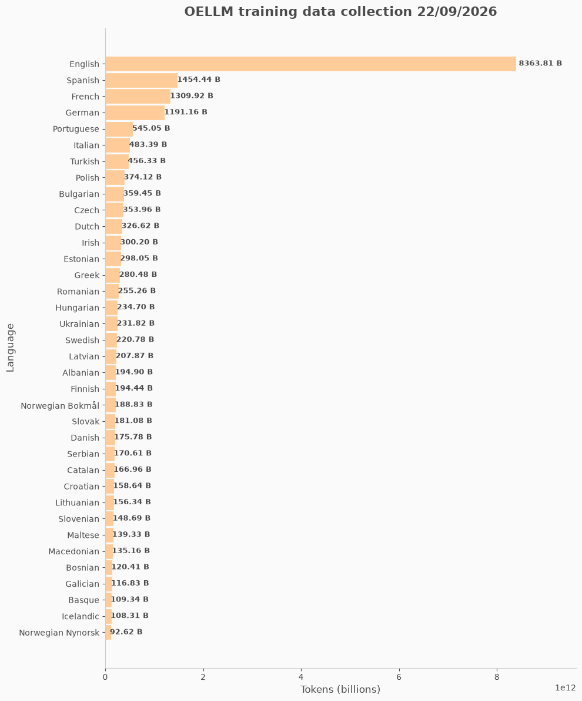

Please log your team name in the following table once you pick a language and start working with it. These are all the priority languages with information about data availability and the team in charge for a particular cycle: 


|Language|Data availability| Cycle 0 - Completed | Cycle 1 - Ongoing|
|--------|--------------|------------------|------------------|
|Albanian|low|ELDA | | 
|Basque|very low| ELDA | Prompsit | 
|Bosnian|low| ELDA | | 
|Bulgarian|mid-low| ELDA | | 
|Catalan|low| ELDA | | 
|Croatian|low| ELDA | | 
|Czech|mid| ELDA | | 
|Danish|mid-low| ELDA | | 
|Dutch|mid| ELDA | | 
|Estonian|low| ELDA | | 
|Finnish|mid-low| ELDA | | 
|Galician|very low| ELDA | | 
|Georgian|very-low| ELDA | | 
|Greek|mid-low| ELDA | | 
|Hungarian|mid-low| ELDA | | 
|Icelandic|very-low| ELDA | | 
|Irish|very-low| ELDA | | 
|Latvian|low| ELDA | | 
|Lithuanian|low| ELDA | | 
|Macedonian|very low| ELDA | | 
|Maltese|very low| ELDA | | 
|Norwegian Nynorsk|very low| ELDA | | 
|Norwegian Bokmal|mid-low| ELDA | | 
|Polish|mid| ELDA | | 
|Romanian|mid-low|ELDA | | 
|Serbian|low| ELDA | | 
|Slovak|mid-low| ELDA | | 
|Slovenian|low| ELDA | | 
|Swedish|mid-low| ELDA | | 
|Turkish|low| ELDA | | 
|Ukrainian|mid-low| ELDA | | 

The tiers correspond to the following token availability ranges: very low (<10BT), low (>10-40BT), mid-low (>40-120BT), mid (>120BT).

Cycle 0 (completed): broad identification and recording of new sources for all languages. 
Cycle 1 (started): by language, including identification, recording, download and storage. 

<h3>1.3 Recording resources in the shared Google sheets</h3>

We share a [Google sheets](https://docs.google.com/spreadsheets/d/1ERMeyCK1gKepeToE2TkwSuv_xYyQbggwaCYIIp3k-Y0/edit?gid=0#gid=0) document where we need to add every data source and its relevant or helpful information. Some of the information has pre-defined dropdown lists. Increasing the options in these lists is possible, but please check carefully if no other preexistent suitable (or near suitable) option is available.

Columns in red will be used as part of the metadata for each file uploaded to the database. Columns marked in grey correspond to useful or additional information, but these columns will not be included in the final metadata.


<h4>1.3.1 Metadata columns</h4>

- **LANGUAGE_CODE**: ISO 639 3 letter language code.

- **SCRIPT_LANG**: ISO 15924 4 letter script system code.

- **LANGUAGE**: closed name list of languages.

- **VARIANT**: (expandable) custom list of variants.

- **TOPIC**: close list of topics.

- **DATASET_NAME_OR_DESCRIPTION**: name that describe the file collection.

- **DATE_OF_IDENTIFICATION**: approximate date of identification or the start of the final URL extraction. It must be used the DD/MM/YYYY format.

- **LICENSE**: (expandable) list of licenses.

- **SOURCE_ORGANIZATION**: organization or company providing the desired files.

- **DATA_TYPE**: (expandable) list of file formats.

- **SOURCE_IDENTIFICATION_URL**: it is important to add only one URL. This must describe the general start point for the by document URL extraction. Therefore, it is better to use the URL closest to the document set, especially if it is necessary to navigate through sections or subsections.

- **COMMENTARY**: free text to explain relevant data to have into account in the metadata. NOT MANDATORY.

- **MIXED_LANGUAGES**: list of co-present languages in the files. These must be separated by a comma (,), always written in the same form as in the LANGUAGE column, or as written before in any column if this language is not present in the LANGUAGE column.

- **CONTACT**: if it is needed it is possible to add a contact email. NOT MANDATORY.

<h4>1.3.2 Non metadata columns</h4>

- **uploaded to the database**: only mark "yes" if all the files in the URL are properly validated and uploaded to the database.

- **size (Token, Docs, GB)**: it can be used to indicate the aproximately size of the desired documents. It might be helpful to know that all the documents have been extracted in the second step.

- **relevant urls**: here it is useful to add the URLs of the sections where the actual data is linked. For example, we would save the following URLs in this website: https://www.argia.eus/multimedia/podcastak and https://www.argia.eus/multimedia/videos instead of just https://www.argia.eus/. This will make the next step much easier. Multiple URLs separated by a line break can be saved in the same cell.

- **worth gathering?**: it is a three-level score used to summarize all the information observed or identified during the assessment, scraping, or usability issues. Files with poor linguistic quality or that are very difficult to extract may not be a priority if they slow down the process. This can be represented by this score.

- **presence of anti-robot**: mark it if the presence of anti-robots is observed, like Google recaptcha or Cloudflare bot management.

- **in OpenEuroLLM catalogue?**: present or not.

- **identified by**: use always the same name, with your organization in parentheses.

- **legal comments**: free text to explain possible legal issues.

- **risk scale**: this is a score to summarize the legal problems into a risk scale.


<h2>2.	Extracting final URLs</h2>
<h3>2.1.	Basic information</h3>

After gathering data sources, it is needed to extract all URLs where every single file is placed.

The first step in this process is to identify the structure of the data on the website. Then, for each document, it is necessary to assemble a JSON file with metadata as in this example:

```
{
    "LANGUAGE_CODE": "eus", 
    "SCRIPT_LANG": "Latn", 
    "VARIANT": "Batua (Standard Basque)", 
    "TOPIC": "Culture", 
    "DATA_TYPE": "pdf", 
    "SOURCE_ORGANIZATION": "Euskariana", 
    "LICENSE": "CC-BY-NC-SA-4.0", 
    "DOWNLOAD_SOURCE": "https://www.euskariana.euskadi.eus/euskadibib/es/media/group/1557223.do", 
    "MIXED_LANGUAGES": ["Spanish", "French"], 
    "COMMENTARY": "", 
    "DATASET_NAME_OR_DESCRIPTION": "Euskariana", 
    "DATE_OF_IDENTIFICATION": "31/01/2026",
    "CONTACT": "",
    "SOURCE_IDENTIFICATION_URL": "https://www.euskariana.euskadi.eus/euskadibib/es/content/sections.do"
}
```
There is one column that need to be created specifically for this JSONL file:

- **DOWNLOAD_SOURCE**: is used to store the complete and final URL of the file. This must be a direct access or direct download link. If there is any relevant issue for the download step, this can be explained in the _COMMENTARY_ section. In the download step, if the file contains multiple files inside, like in a ZIP or RAR, the _DOWNLOAD_SOURCE_ value must be the URL of the compressed file. The file will be automatically uncompressed, and every document inside will have its own metadata based on the JSONL entry.

Lastly, the validation and download process will create automatically more data fields:

- **MACRO_LANG**: the macro code for the ISO 639 provided by the _iso639-lang_ Python package.

- **LANGUAGE**: the language name used by the _iso639-lang_ Python package.

- **PATH**: a combintation of _LANGUAGE_CODE_ + _DOWNLOAD_SOURCE_ without the document name. This will be the location in the database of the file. The intention is to mirror the original location of the documents.

- **NAME**: it corresponds to the file name, including its extension. The extension may change due to post-processing used to prevent database overload. For example, video files are converted to MP3 documents and WAV files are also converted to MP3 documents.

The rest of the metadata is derived from the corresponding rows of the Google sheet document.

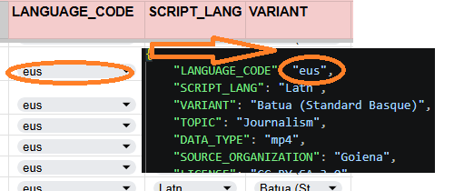

To extract the data from the Google sheets document the codes in [this notebook](notebooks/get_data_from_Google_sheets.ipynb) can be used or simply copy-paste from the row of interest.

<h3>2.2.	Extracting the final URLs</h3>

There are several strategies that can be used to extract the final files and theis URLs. To assist with this process, we have provided examples of some real websites, we have completed for the Basque language in section 7.


<h2>4.	Uploading the JSONL files to the server</h2>

<h3>4.1.	Validation</h3>


TBC

<h2>5. Automatic downloading of the files to a cluster</h2>
TBC

<h2>6. Automatic processing of the files</h2>

TBC


<h2>7. Recommendations and examples by Prompsit</h2>

<h3>7.1.    Tips on how to find relevant data </h3>

First, it is recommended to search for government or regional official websites, institutions, ministries or publicly funded associations, looking for sections named “publications” or similar. These public websites used to cite other websites they fund or with which they collaborate. 

Then, looking for official state gazettes, civil/penal codes, constitutions and other public legal documents can lead to good results. 

After that, is may be worth searching for annual reports of banks, big companies, NGOs, etc.

Besides this, the [CC](https://search.creativecommons.org/) search portal may be good to find other types of permissively licensed data. A good idea is to use random words from different topics plus the required format in quotes, for example, ‘gardening “pdf”’ or ‘sports “mp3”’. Looking for radios, televisions or podcasts in this CC searcher is also a good idea to find archived recorded programs.

<h3>7.2.    Tips on how to extract final URLS</h3>

Generally, in the data sources found, there are a few types of data structures:

<h4>7.2.1 All the desired links are easily collectable from a single webpage</h4>

In this cases, if pagination is not very long, links can be collected by inspecting the page manually and copying the element that contains them:

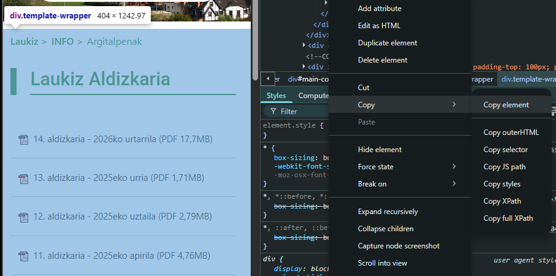

Then, one can use a simple [Python tool](notebooks/all_files_from_copied_selection.ipynb) to extract URLs:

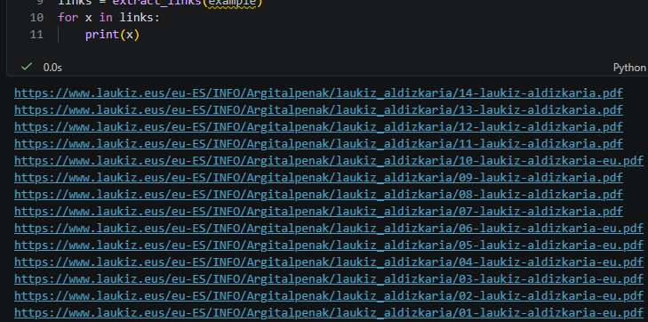

It is also possible to use a regex like `href="(.*?.pdf)"` or other tools but the former is a very quick option.

If, on the other hand, if pagination is very long, one can scrap the box where the files of interest are placed and then extract automatically all file links. In these cases, the [Python tool](notebooks/all_files_in_box_with_pagination.ipynb) can be used. In this example the numbers of the "<a>" tags were used to extract all pagination links:

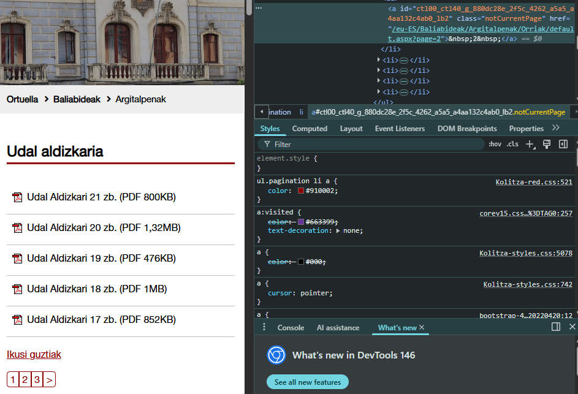
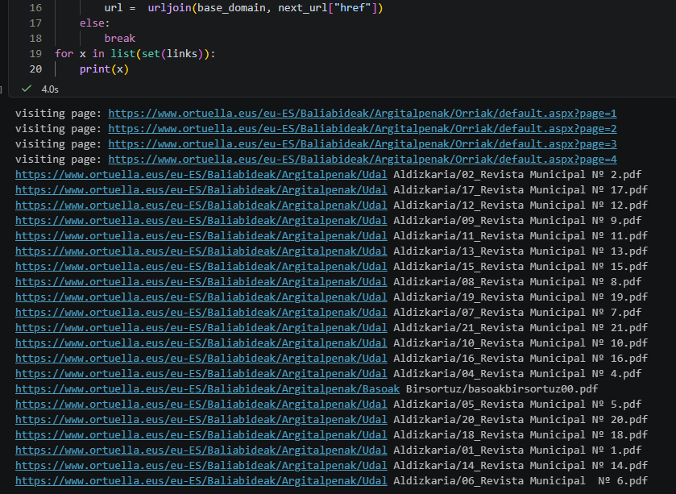

There are multiple options even in this page. It is possible to explore URLs using the GET attribute "page":

- https://www.or[...]ault.aspx?page=1

In these cases you need to make sure that the number of pages is consistent, otherwise, if you try to access to some wrong URLs, it is possible that the server blocks your IP.

Another usefull way to visit all the needed pages is to extract always the ">" button, until it is not present. This would need some changes in the [script](notebooks/all_files_in_box_with_pagination.ipynb).

<h4>7.2.2 An ad hoc crawler/method is needed</h4>

Often, it is impossible to only copy and extract links. Some websites need to be analyzed before choosing a valid method. The different examples below show different problems already found and possible approaches to solve them:

- ARGIA: This news site has an interesting podcast section at https://www.argia.eus/.


First, access each podcast manually, e.g. https://www.argia.eus/multimedia/menda-bikoitza. Take a moment to explore a bit each podcast topic/domain to refine the info in the shared Google Sheets. 

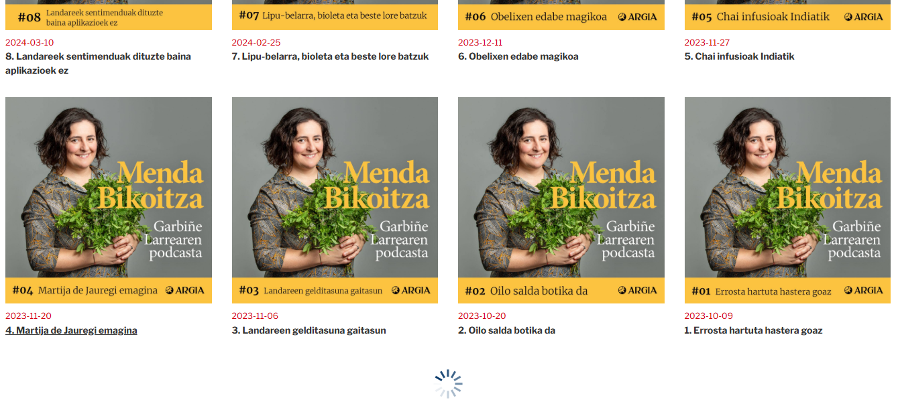

Then, copy the HTML element where each chapter of the podcast is placed. Make sure that all podcasts are visible (e.g. scroll down the page to make the appear) before copying the HTML element.

- Gipuzkoa Official Gazette

The Gipuzkoa Gazette is intended to be explored by date or by keyword:

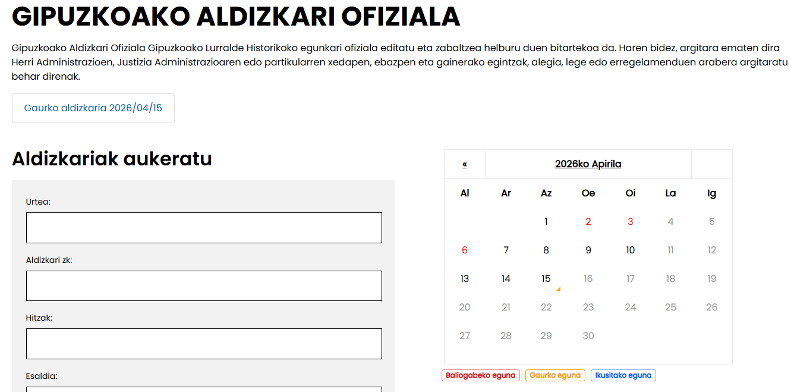

In this case, searching by year was the most sucessful strategy to get all the records. The year, e.g. 1996, was part of the URL in the GET attribute (`_BoletinOficial_WAR_LEEboletinOficialportlet_anio=1996`):

- `https://egoitza.gipuzkoa.eus/eu/gao?p_p_id=BoletinOficial_WAR_LEEboletinOficialportlet&p_p_lifecycle=0&_BoletinOficial_WAR_LEEboletinOficialportlet_d-4021526-p=1&_BoletinOficial_WAR_LEEboletinOficialportlet_myaction=busqueda&_BoletinOficial_WAR_LEEboletinOficialportlet_isAvanzada=false&_BoletinOficial_WAR_LEEboletinOficialportlet_anio=1996`


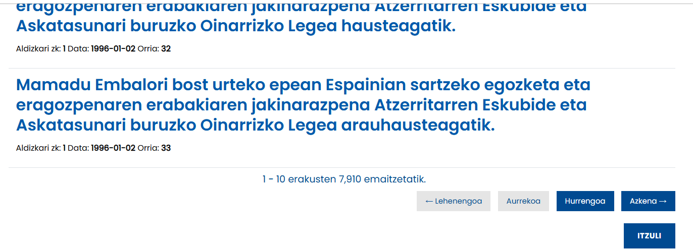

Each year could be processed as a regular page with pagination. In this case, however, it is necessay to do a two step page visit, becasuse the direct link of the final is inside the first one.

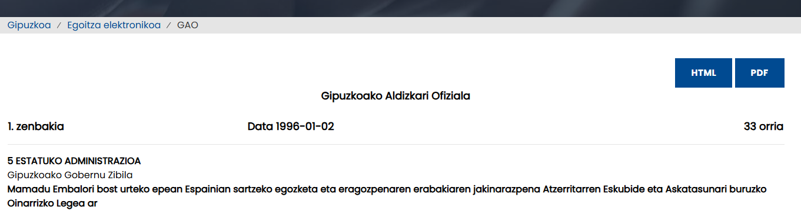

In similar cases, scraping the whole page and saving the intermediate links in a file can be useful to then, extract the final links in a subsequent step. For example, saving all the links in the above mentioned page in a txt results in:

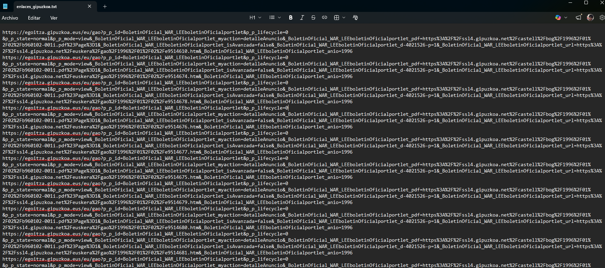

Then, one can visit them to extract the links behind the "PDF" button. Be careful and avoid visiting them all at the same time, because you can overload the server and be banned.

<h2>8. Recommendations and examples by ELDA</h2>
